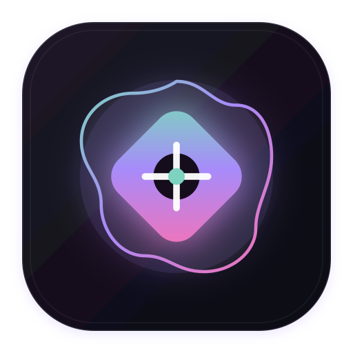

<div align="center">



# 💠 End4-mac

### *A macOS-native recreation inspired by end4-pC / illogical-impulse, redesigned for macOS using modern desktop architecture.*

[](https://www.gnu.org/licenses/gpl-3.0)
[](https://apple.com)
[](https://electronjs.org)
[](https://reactjs.org)
[](https://vitejs.dev)
[](https://m3.material.io)

<br />

<p align="center">
  <b>End4-mac</b> brings the visual language of <a href="https://github.com/pctrade/end4-pC">end4-pC / illogical-impulse</a> to macOS as an Electron desktop companion, with expressive widgets, local shader scenes, an app launcher, media controls, and dynamic theming.
</p>

</div>

---

> [!IMPORTANT]
> The upstream project is a Linux Quickshell configuration for Hyprland/Niri, not a Windows application. macOS does not expose equivalent compositor, workspace, or Control Center APIs, so this port recreates the experience without replacing Finder, Spaces, or the macOS window manager.

## 🌟 Key Highlights

```
┌─────────────────────────────────────────────────────────────────────────────┐
│                             FLOATING STATUS BAR                             │
│   [Quick settings]          [12:45 PM | 33°C]         [Media | 85% | Wi-Fi] │
└─────────────────────────────────────────────────────────────────────────────┘
┌───────────────────────┐  ┌─────────────────────┐  ┌─────────────────────────┐
│   LEFT QUICK-PANEL    │  │    COOKIE CLOCK     │  │    RIGHT MEDIA & AI     │
│  • Wi-Fi / Bluetooth  │  │                     │  │  • Now Playing Card     │
│  • Dark Mode          │  │   (M3 7-Scallop)    │  │  • Synchronized Lyrics  │
│  • Native sliders     │  │   Analog + Date     │  │  • AI Assistant (Chat)  │
│  • 5-Day Weather      │  │                     │  │  • CPU / RAM Live Gauge │
└───────────────────────┘  └─────────────────────┘  └─────────────────────────┘
┌─────────────────────────────────────────────────────────────────────────────┐
│                       LIVE WALLPAPER & SHADER ENGINE                        │
│      [Aurora Borealis]   [Fluid Waves]   [Cosmic Stars]   [Retro Grid]      │
└─────────────────────────────────────────────────────────────────────────────┘
```

---

## 🚀 Features

### 1. 🖼️ Live Wallpaper & Shader Engine
* **Interactive Canvas Shaders:**
  * 🌌 **Aurora Borealis:** Fluid, multi-point organic mesh gradients with smooth particle drifts.
  * 🌊 **Fluid Waves:** Flowing multi-layer harmonic sine wave ribbons.
  * ✨ **Cosmic Stars:** Deep space starfield with realistic twinkling stars and glowing nebulae.
  * 🌆 **Retro Grid:** 80s Cyberpunk horizon sunset with perspective vanishing rays.
* **Online Wallpaper Search (Wallhaven API):**
  * Integrated online search directly querying Wallhaven's repository with categories (*General*, *Anime*, *People*).
* **Material 3 Centered Shape Cutouts:**
  * Procedural bezier-curve scallop shapes (Cookie 7, 9, 12, 16-sided, Flower, 4-Leaf Clover) with customizable opacity, tint, and optional continuous rotation.
* **Filters:**
  * Real-time blur (0–18px) and dimming (0–60%) sliders.

### 2. ⏰ On-Desktop Material 3 Widgets
* **Cookie Analog Clock:** Signature Android 12/14/M3 expressive scallop analog clock with continuous rotating hour/minute/second hands and date indicator pill.
* **Bold Typography Digital Clock:** Large Material display typography with date and live weather conditions.
* **Ambient Visualizer:** A lightweight animated pulse shown alongside current media state.
* **Desktop Weather Card:** Live temperature, apparent temperature, humidity, and wind speed from Open-Meteo.
* **System Resource Radial Meters:** Live animated SVG circular meters for CPU and RAM consumption.

### 3. 🎛️ Wallpaper & Engine Customizer (`⌘⇧,`)
* One-click modal to switch between Presets, Online Wallhaven Wallpapers, Live Shaders, M3 Shape cutouts, and Desktop Widgets.
* Still images are downloaded safely and applied to the native macOS desktop; shader scenes run inside the shell window.
* **Dynamic Material You Auto-Theming:** Extracts dominant color palettes from any chosen wallpaper in real-time and applies tonal variations across the entire UI.

### 4. 🚀 macOS Desktop Companion
* **Floating Pill Status Bar:** Top center glassmorphic pill with a live clock, local weather, volume, Wi-Fi, battery, and media marquee.
* **Click-through Desktop Layer:** Normal clicks pass through to Finder and other applications; shell controls become interactive on hover and panels become focusable when opened.
* **Left Quick-Settings Sidebar (`⌘⇧A`):**
  * Native **Wi-Fi** and **Dark Mode** controls. Bluetooth and brightness controls are enabled only when their optional command-line helpers are installed; unavailable controls are clearly disabled.
  * System volume control, an interactive calendar, and a local forecast.
* **Right Sidebar (`⌘⇧N`):**
  * **Now Playing Card:** Album art, title, artist, progress scrubber, and playback controls (Spotify & Apple Music).
  * **Synchronized LRCLIB Lyrics:** Real-time time-synced scrolling lyrics matching audio playback.
  * **Notes & Tasks Widget:** Persistent quick notes saved via localStorage.
  * **AI Assistant Tab:** Chat interface for a local Ollama (`llama3`) model.
* **App Launcher (`⌘⇧Space`):**
  * Real-time search across `/Applications` and `/System/Applications`.
  * Inline calculator with instant math evaluation (`= 42 * 8`).
  * Quick actions for theme, screenshots, Downloads, Activity Monitor, and web search fallback.

---

## ⌨️ Keyboard Shortcuts

| Shortcut | Action |
|---|---|
| <kbd>⌘</kbd> + <kbd>⇧</kbd> + <kbd>Space</kbd> | Open App Launcher & Calculator |
| <kbd>⌘</kbd> + <kbd>⇧</kbd> + <kbd>,</kbd> *(or Click Clock)* | Open Wallpaper & Widget Settings |
| <kbd>⌘</kbd> + <kbd>⇧</kbd> + <kbd>A</kbd> | Open Left Quick-Settings Sidebar |
| <kbd>⌘</kbd> + <kbd>⇧</kbd> + <kbd>N</kbd> | Open Right Media & AI Assistant Sidebar |
| <kbd>Esc</kbd> | Dismiss any open modal, sidebar, or launcher |

---

## 🏗️ Architecture & Project Structure

```
End4-mac/
├── electron/                         # Native macOS Main Process (Node.js/CJS)
│   ├── main.cjs                      # Window creation, tray, global shortcuts, IPC
│   ├── preload.cjs                   # Secure ContextBridge API exposure
│   └── services/                     # Native macOS service backends
│       ├── audio.cjs                 # Volume & mute control via osascript
│       ├── battery.cjs               # Battery percentage & charging via pmset
│       ├── brightness.cjs            # Display backlight control
│       ├── media.cjs                 # Apple Music & Spotify playback bridge
│       ├── command.cjs               # Safe argument-based process execution
│       ├── network.cjs               # Wi-Fi state and IP via public macOS tools
│       ├── system.cjs                # CPU, RAM, and Application directory scanning
│       ├── toggles.cjs               # Capability-aware native quick toggles
│       └── wallpaper.cjs             # Safe native wallpaper application and download cache
├── src/                              # Renderer Process (React 19 + Vite)
│   ├── App.jsx                       # Main shell coordinator
│   ├── main.jsx                      # React entry point
│   ├── assets/                       # Local offline fonts, custom icons & wallpapers
│   ├── hooks/
│   │   └── useSystemData.js          # Polling & optimistic hooks for system telemetry
│   ├── modules/
│   │   ├── bar/                      # Floating status bar pill
│   │   ├── desktopWidgets/           # Cookie clock, digital clock, visualizer, weather, meters
│   │   ├── overlay/                  # Spotlight app launcher & calculator
│   │   ├── sidebarLeft/              # Quick toggles, 120fps sliders, calendar
│   │   ├── sidebarRight/             # Media card, synced lyrics, notes, AI chat
│   │   ├── wallpaperEngine/          # Shaders, centered shapes, background manager
│   │   └── wallpaperSelector/        # Wallpaper & widget customizer modal
│   ├── services/                     # Frontend API services
│   │   ├── AiService.js              # Ollama & Gemini assistant integration
│   │   ├── LyricsService.js          # LRCLIB synchronized lyrics client
│   │   └── OnlineWallpapersService.js# Wallhaven API client
│   ├── styles/
│   │   ├── design-tokens.css         # 190+ Material 3 CSS custom properties
│   │   └── globals.css               # Reset, typography, glassmorphism utilities
│   └── theme/
│       └── MaterialTheme.jsx         # Dynamic HCT/M3 tonal palette extractor
├── index.html                        # Application HTML shell
├── package.json                      # Project dependencies & build scripts
└── vite.config.js                    # Vite bundler configuration
```

---

## 📦 Getting Started

### Prerequisites
- macOS 12.0 (Monterey) or later (Apple Silicon & Intel supported)
- [Node.js](https://nodejs.org) (v18 or newer)
- npm / yarn / pnpm
- Optional: `brew install brightness blueutil` for display brightness and Bluetooth controls

### Installation

1. **Clone the repository:**
   ```bash
   git clone https://github.com/satiricalguru/End4-mac.git
   cd End4-mac
   ```

2. **Install dependencies:**
   ```bash
   npm install
   ```

3. **Run the application:**
   ```bash
   # Launch as native macOS desktop app
   npm start
   ```

4. **Run in development mode (with Vite Hot Module Replacement):**
   ```bash
   npm run electron:dev
   ```

5. **Build for production:**
   ```bash
   npm run build
   npm run pack:mac   # unsigned local .app
   npm run dist:mac   # DMGs; signing identity required for distribution
   ```

---

## 🎨 Theming & Customization

End4-mac implements the **Material 3 Expressive Design System**:
- **Dynamic Palette Extraction:** Change your wallpaper in the customizer (`⌘⇧,`), and the application will extract the dominant tones to generate primary, secondary, tertiary, and container colors dynamically.
- **Glassmorphism:** Uses `-webkit-backdrop-filter: blur(40px)` with tailored opacity layers (`--glass-bg`, `--glass-border`).
- **Offline Font Support:** Includes `MaterialSymbolsRounded.ttf` bundled locally for fast, reliable icon rendering without internet connectivity.

---

## 👥 Contributors & Credits

This macOS port builds upon the foundation and creative work of the developers and contributors of the upstream [end4-pC](https://github.com/pctrade/end4-pC) repository and [illogical-impulse](https://github.com/end-4/dots-hyprland). Sincere gratitude to all contributors for their widgets, designs, and ideas!

### 🌟 Upstream `pctrade/end4-pC` Contributors

<table>
  <tr>
    <td align="center">
      <a href="https://github.com/pctrade">
        <br />
        <sub><b>pctrade</b></sub>
      </a><br />
      <sub>Creator & Maintainer</sub>
    </td>
    <td align="center">
      <a href="https://github.com/anaskhaann">
        <br />
        <sub><b>Mohd Anas Khan</b></sub>
      </a><br />
      <sub>Contributor</sub>
    </td>
    <td align="center">
      <a href="https://github.com/reazndev">
        <br />
        <sub><b>Reazndev</b></sub>
      </a><br />
      <sub>Contributor</sub>
    </td>
    <td align="center">
      <a href="https://github.com/Naguuw">
        <br />
        <sub><b>Naguuw</b></sub>
      </a><br />
      <sub>Contributor</sub>
    </td>
  </tr>
  <tr>
    <td align="center">
      <a href="https://github.com/XephyLon">
        <br />
        <sub><b>Xephy Lon</b></sub>
      </a><br />
      <sub>Contributor</sub>
    </td>
    <td align="center">
      <a href="https://github.com/hassankhan2608">
        <br />
        <sub><b>hassankhan2608</b></sub>
      </a><br />
      <sub>Contributor</sub>
    </td>
    <td align="center">
      <a href="https://github.com/tura-ai-agent">
        <br />
        <sub><b>tura-ai-agent</b></sub>
      </a><br />
      <sub>Contributor</sub>
    </td>
    <td align="center">
      <a href="https://github.com/end-4">
        <br />
        <sub><b>end-4</b></sub>
      </a><br />
      <sub>Original Concept</sub>
    </td>
  </tr>
</table>

### 🍎 macOS Port Maintainer
- **[Jatin Pandey (@satiricalguru)](https://github.com/satiricalguru)** — macOS native port architecture, Electron main process, React 19 modules, and shaders.

---

## 🤝 Acknowledgements

- **[pctrade](https://github.com/pctrade)** & **[end4-pC contributors](https://github.com/pctrade/end4-pC/graphs/contributors)** for the upstream desktop rice.
- **[end-4](https://github.com/end-4)** for the original Linux [illogical-impulse / dots-hyprland](https://github.com/end-4/dots-hyprland).
- **[LRCLIB](https://lrclib.net)** for the open-source synchronized lyrics database.
- **[Wallhaven](https://wallhaven.cc)** for high-resolution desktop wallpapers.
- **[Open-Meteo](https://open-meteo.com)** for free weather forecasts.

---

## 📄 License

This project is open-source software licensed under the **[GNU General Public License v3.0 (GPL-3.0)](LICENSE)**.
